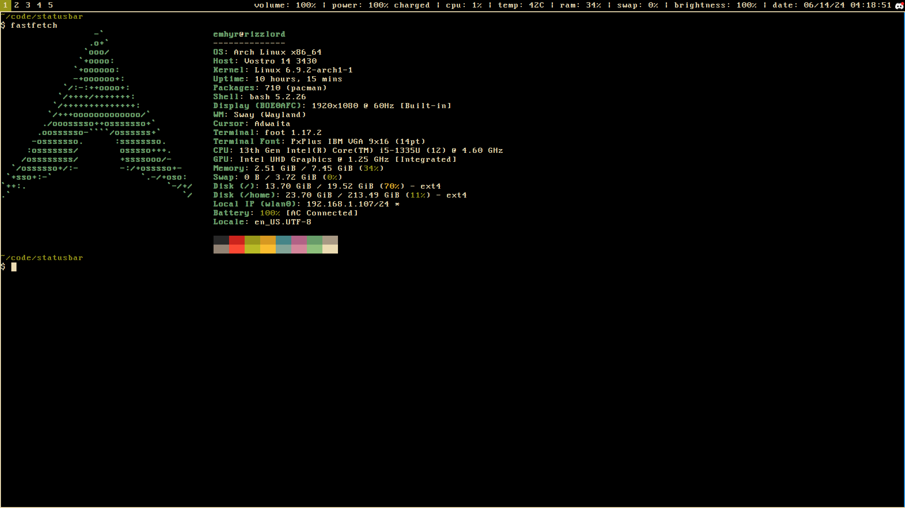

# `statusbar`

the [sway](https://swaywm.org/) statusbar that i use written in pure C!!!

> [!WARNING]
> this is _very_ self-personalized; it might not work on your system without tinkering the source code :sweat_smile:.

## plans

i have no plans other than adding things i want without a care for generalizing the half-ass codebase.

